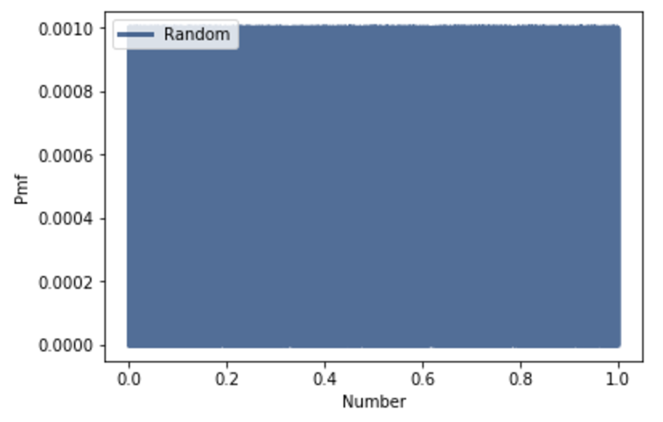
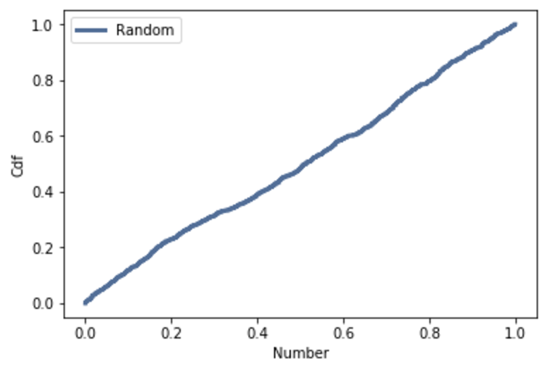

[Think Stats Chapter 4 Exercise 2](http://greenteapress.com/thinkstats2/html/thinkstats2005.html#toc41) (a random distribution)

Exercise: The numbers generated by numpy.random.random are supposed to be uniform between 0 and 1; that is, every value in the range should have the same probability.

Generate 1000 numbers from numpy.random.random and plot their PMF. What goes wrong?

Now plot the CDF. Is the distribution uniform?

>> 
```
rand = np.random.random(1000)
```
```
pmf = thinkstats2.Pmf(rand, label='Random')
thinkplot.Pmf(pmf)
thinkplot.Config(xlabel='Number', ylabel='Pmf')
```


This distribution fills up the entire area and does not depict much useful information other than the fact that everything has a 0.1% probability.
```
cdf = thinkstats2.Cdf(rand, label='Random')
thinkplot.Cdf(cdf)
thinkplot.Config(xlabel='Number', ylabel='Cdf')
```


This distribution is uniform and shows the probability of each number as they increase.
